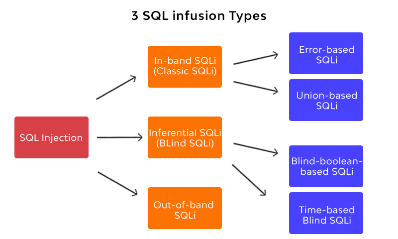
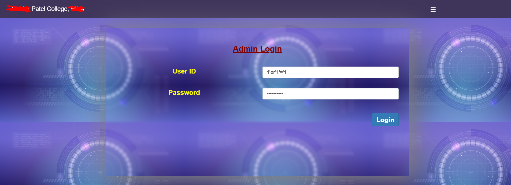
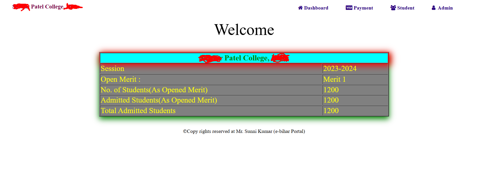
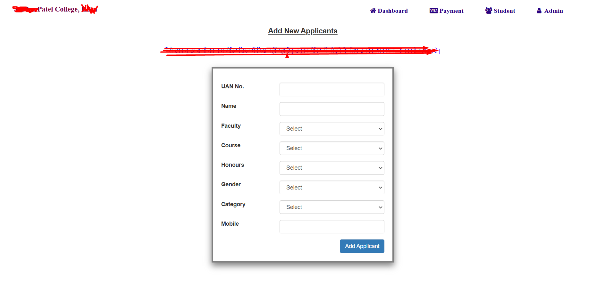
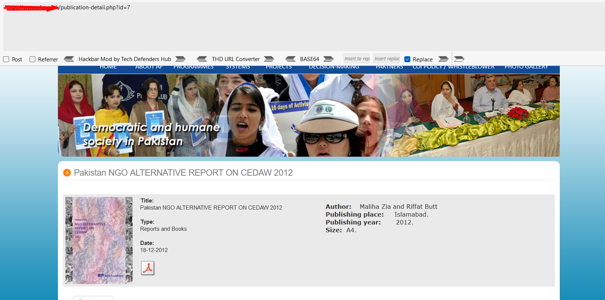
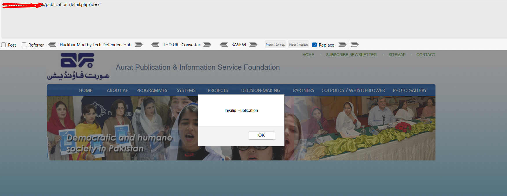

# SQL-Injection
# This is only for educational purpose
# Introduction
SQL Injection (SQLi) is one of the most common and critical vulnerabilities in web applications. It occurs when an attacker exploits improper input handling in SQL queries, enabling them to manipulate the database by injecting malicious SQL code. This flaw arises due to inadequate validation and sanitization of user inputs. SQLi can lead to unauthorized data access, data loss, or even complete compromise of a database. Despite being a well-documented vulnerability, it remains a persistent challenge in the field of cybersecurity.

# Problem Statement
Many web applications rely on databases to store and retrieve data. These databases are accessed using Structured Query Language (SQL). When user inputs are directly included in SQL queries without adequate sanitization, attackers can inject malicious SQL code to alter the intended query logic. This allows attackers to:

1. Access sensitive data such as user credentials, financial information, or personal records.
2. Modify or delete database records, causing data integrity issues.
3. Bypass authentication mechanisms to gain unauthorized access.
4. Escalate privileges or execute administrative functions.

The persistence of SQLi vulnerabilities stems from a lack of secure coding practices, improper input validation, and insufficient awareness among developers.

# Objective
The objective of studying SQL Injection is to:

1. Understand the mechanics of SQL Injection attacks and how they exploit vulnerabilities in database interactions.
2. Highlight the potential consequences of SQLi attacks on web applications and users.
3. Develop secure coding practices to prevent SQLi vulnerabilities.
4. Educate developers and security professionals on the importance of input sanitization and parameterized queries.
5. Explore tools and techniques for detecting and mitigating SQLi attacks in existing web applications.
By addressing SQL Injection vulnerabilities, organizations can protect sensitive data, enhance application security, and comply with industry standards such as OWASP's top 10 and PCI DSS.

There are many types of SQL injection:

 

I am going to show you some live application SQL Injection. 

At first, i will show you Blind-boolean SQL Injection.

For this i will use cheat sheet for sql injection and google dork to find website. You can find all cheat sheets and drok in the cheat sheets file.

You can execute this cheat sheets in the login field like username and password. 

Here in this website i just used 1'or'1'='1 this cheat sheet in login and password form. It gives me the access of the admin panel. :tada:

 
After excute the login with this cheat code i got the access of Admin panel
 

Here i can see the all informaton. 

here i can add students as a admin.

This is all about Blind Boolean SQl injections demo.

  

Now we are going to learn Error Based and Union based SQL Injection. 

For this i am going to use cyberfox with hackbar.

#### This attack only work in dynamic website where you can find parameter and value .

for example: https://www.af.org.pk/publication-detail.php?id=7 

Here id = parameter and 7= value

In this website i will do sql injection. 
To check if a website has sql injection vulnerability or not you just give a string (') that is in bracket after the value and press enter . Now after this if this website gives any error or change the interface of the page then here we can perform sql injection neither not.  
Let's check it.

After give the string it changes its interface. 

Now, we need to check the coloumn number of the database. 

For this, 